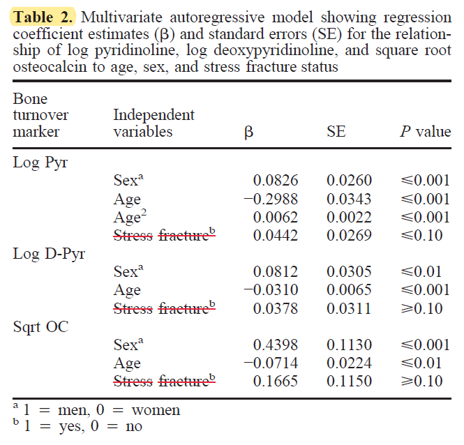

# A 12-month prospective study of the relationship between stress fractures and bone turnover in athletes
[Bennell et al 1998](../References/Bennell1998Prospective.pdf)

### Notes

### Purpose
Accelerated or targeted bone remodeling, while crucial to strengthening bone, may predispose runners to bone injury as bone is weakened between
bone resorption and new bone formation. Biomarkers may be able to help identify times where bone remodeling is occuring, 
predisposing runners to injury. 
1. See if baseline biomarkers of bone turnover can help detect at-risk athletes over 12-month period.
1. Relate measurements taken regularly to stress fracture status in the months leading up to and following stress fracture.

### Methods
95 track and field athletes in athletics club, age 17-26:
- 16 sprinters
- 35 middle-distance
- 19 long-distance
- 11 hurdles, 10 jumps, 4 multi

biomarkers:
- draw blood and take urine samples. Looking for **osteaocalcin** and pyridinium cross-links and N-telopeptides of type 1 collagen (urine).
-
bone mass: 
- DXA scan

also collected data on menstrual status.

Stats: logistic regression and t-tests.
### Results

    
*I love this regression table. No effect of stress fracture status on biomarkers though.*

- 22% of women and 20% of men had at least one stress fracture 
- 45% tibia, 15% navicular, 12% fibula, 8% metatarsals

- no effect of age, height, weight, weekly training volume/distance between injured/uninjured

#### Does a baseline measure of bone turnover biomarkers predict which athletes will get injured?
Nope. 
#### What about monthly measures of bone turnover biomarkers? Matching injured vs controls
A lot of variability. They want it to be legit (saw increases), but standard errors were HUGE (see figure above)
#### Do biomarker levels differ before and after a stress fracture?
Nah... too much variability within and between subjects.I like this plot idea though for PAC12 data:

### Discussion
Overall, there was monthly variability ranging from 21-29%. Null findings. Suggest taking more samples or switching to animal model so 
this can be done regularly (daily?)

### Notable References
1. Bone density: Bennell 1996 Risk factors for stress fractures in track and field athletes: a 12-month prospective study