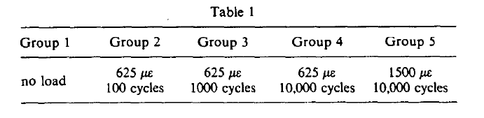

# Bone remodeling in response to *in vivo* fatigue microdamage
[Burr et al 1985](../References/Burr1985Bone.pdf)

### Notes
This is the dog ulna study. 

### Purpose
Determine thresholds for forces causing microdamage to bone *in vivo* and demonstrate that bone damage may be related to 
osteon activity/bone remodeling. 

### Methods
##### Experiment 1 (determine fatigue thresholds)
- 11 adult stray dogs had strain gauges attached to their radius and underwent a 3 point bending test at 2Hz. 
- Applied forces similar to those experienced during walking, although the bending was different than normal.
- Dogs separated into 5 groups of loading: control + 4 variations of force/number of cycles:    
    
- After loading, dogs were sacrificed and bones were removed and microscopy was performed on a sample. 
##### Experiment 2 (Observe bone remodeling)
- 8 adult stray dogs went through the same proceude but only at 1500 microstrain for 10k cycles (equivalent to Group 5)
- Dogs were sacrificed after 1, 2, or 4 days to allow for bone remodeling to begin, then used microscopy to analyze damage
### Results 
##### Experiment 1
- 1500 microstrains for 10k cycles produced increases in microdamage compared to controls and other strain groups.
This is like 11 miles of running for a dog (~1 or 2 days of activity)
##### Experiment 2
- Radii and Ulnae were grouped together to increase sample size
- Found evidence of bone resorption at damage locations and an association between microcracks and repair sites.
### Discussion
Evidence supports potential cause/effect relationship between accumulation of fatigue damage and bone remodeling in areas
where the damage occurs. Low thresholds for fatigue damage suggest our bones may be remodeling all the time during typical
daily activity. 

Bones adapt to the load placed upon them: Bouvier and Hylander 1981 fed macaques one of two diets, consisting of either
hard or soft food. They found greater bone remodelling in the monkeys who ate the hard diet. Hypothesized that increased
remodelling was a product of high straings and/or increased number of load cycles (bites/chews). 
### Notable References
1. Martin and Burr (Hypothetical mechanism for the stimulation of osteonal remodelling by fatigue damage)
1. Frost 1960
1. Frost 1966