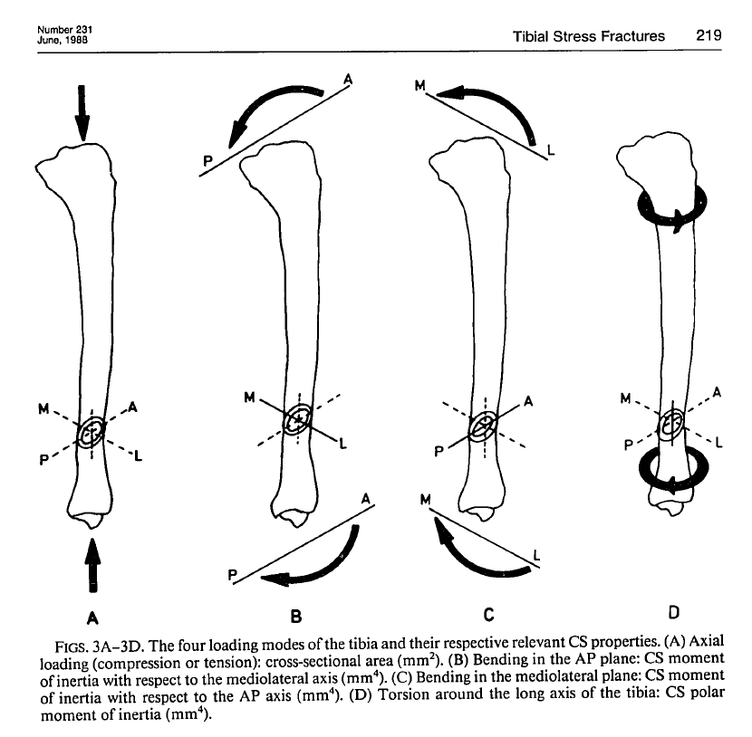

# An Analysis of the Biomechanical Mechanism of Tibial Stress Fractures Among Israeli Infantry Recruits
[Milgrom et al 1988](../References/Milgrom1988Analysis.pdf)

### Notes
Modeled tibia cross section as an elliptical ring with an eccentric hole:
 

### Purpose

### Methods
288 recruits got bone scans and tibial stress fracture locations were recorded. Bone geometry was derived from scans
and served as basis for calculating bone's resistance to compressive/bending forces:

*Tibia experiences bending moments so that the posterior and medial sides are concave (compressive on posterior and 
medial) per Rice et al 2019. Calculations for CS properties are in appendix.*

Cross-sectional areas were measured at two levels: the narrowest Anterior-posterior width and the narrowest Mediolateral width.
### Results
- 20% of recruits got a tibial stress fracture. All were located on the medial cortex of the tibia. 
-  Tibial area moment of inertia about the AP axis of bending at the narrowest ML width was found to significantly contribute
to stress fractures. **Those with wider tibiae had lower incidences of stress fractures.** See Figure 3B
### Discussion
Cross section area moment of inertia "measures the distribution of the area of the bone in relationship to an axis of
bending. The farther the material is distributed away from teh axis of bending, the greater is the ability of the bone 
to resist bending forces"

Bending strength was more important than compression and torsion (Fig 3A & 3D)

### Notable References
1. Daffner Martinez Gehweiler 1982 Stress fractures in runners