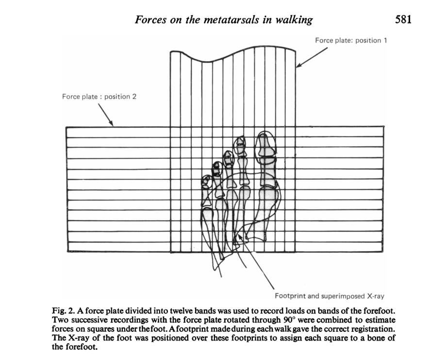

# Forces acting on the metatarsals during normal walking
[Stokes et 1l 1979](../References/Stokes1979Forces.pdf)

### Notes
This paper is using an old-school pressure plate to break the foot into 12mmx12mm squares and
look at the force distribution on the foot. They did this by having the subject walk on a grid
of bands connected to strain gauges! How did they know where the foot was? Put ink on the foot.
What about the bones? Well they took x-rays and superimposed it over the ink-based forces.

### Methods
- 6 subjects walking on a runway
coolest methods ever:

## Discussion
- High concentration of forces on toes and metatarals. deemed "functional areas".
- calculated MTP joint forces for each metatarsal. Looks like metatarsals 1 and 2 have the 
greatest joint forces (~800 & 400N respectively, compared to <200N for rest)
- MT1 had the greatest bending moment, although it occurred late stance. 
- MT2-5 had bending moments of 2-6 N-m during mid stance. Kind of interesting, peaks for 
bending moments occur in almost perfectly decreasing order: 5, 3, 4, 2, 1, perhaps due to pronation.
- Comparing the loads experienced by MH2 and 3 to their size, authors suggest they may be "loaded
out of proportion to their sizes. This suggests why these bones are prone to..." **fractures!**
- excessive bending moments could also be responsible for fracture.
