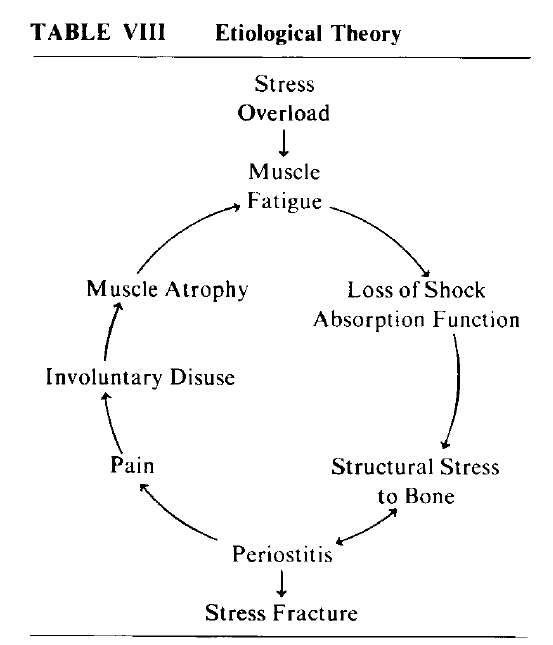

# Tibial stress syndrome in athletes
[Clement 1974](../References/Clement1974Tibial.pdf)

### General Notes:
**Average recovery time for tibial stress syndrome (not necessarily a fracture): 4.8 weeks**

Introduction of a clinical spectrum of injury, with tibial stress syndrome preceding stress fracture. Helpful because
sometimes an x-ray only confirms what you've been experiencing for weeks now: your bone is broke. 

### Presented theory:
 **MUSCLE FATIGUE** in the lower leg, causes a loss of shock absorbing function, resulting in more load
on the bones during impact. Treatment includes strengthening tibialis anterior and gastrocs. 

### Study Design:
records collected from sports med clinic over 10 year span (only 20 athletes though).  Average age of athlete was 17 years 
old and 50% were distance runners. Some werew sprinters, jumpers, volleyball or basketball players.

### Results:
- 16/20 had pain on one leg only
- 13/20 had pain on lower third of tibia
- **Muscles on the affected side had 1.46cm less circumference around the girthiest part of calf.**

### Discussion: 
Tibial stress syndrome (shin pain) comes before a stress fracture. Rest can prevent fracture. 

**Muscle strength and endurance** is said to be important for shock absorption and stabilization (Gelhrter, also Nirschl, also Radin). 
The shock that is typically absorbed by the muscle is instead transmitted to the bone if muscle fatigues or is atrophied.
There is also a suggested cycle of shin pain leading to disuse of that leg's plantar flexors/extensors, which only leads
to less shock absorption:

### Notable References:
1. Radin EL: The Medical Post, Mar, 20: 6, 1973.