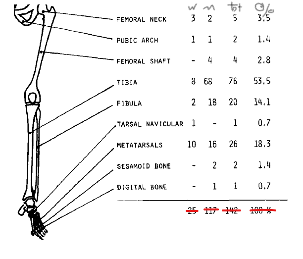

# Stress Fractures Caused by Physical Exercise
[Orava et al 1978](../References/Orava1978Stress.pdf)

### Notes
From Finlad, a survey of 142 stress fractures caused by exercise:

| Activity | Number of Stress Fractures |
|---|---|
|Distance Running | 68 |
|Skiers | 12|
|Sprinters | 10 |
|Orienteering Runners | 9 |
|Vaulters | 3 |
|Football players| 3|

- 76 occurred in tibia
- 26 in metatarsals
- 20 in fibula
- 5 in femoral neck
- 4 in femoral shaft
### Purpose
Provide another descriptive study of stress fracture incidence in physically active populations
### Results
    
*Column headers are: Female, Male, Total, Percent. However, I've removed upper body stress fractures, so subtotals are
incorrect*